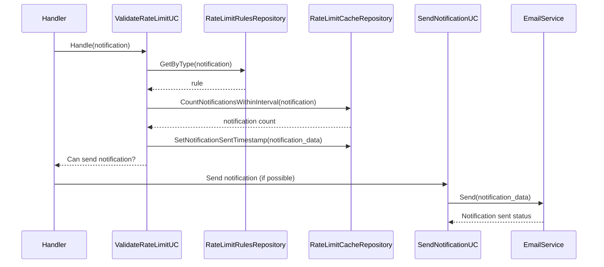
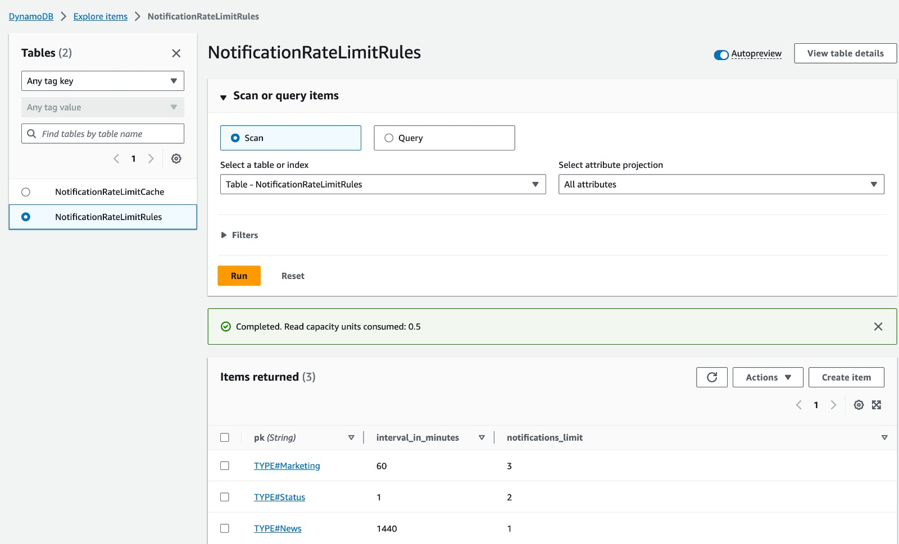
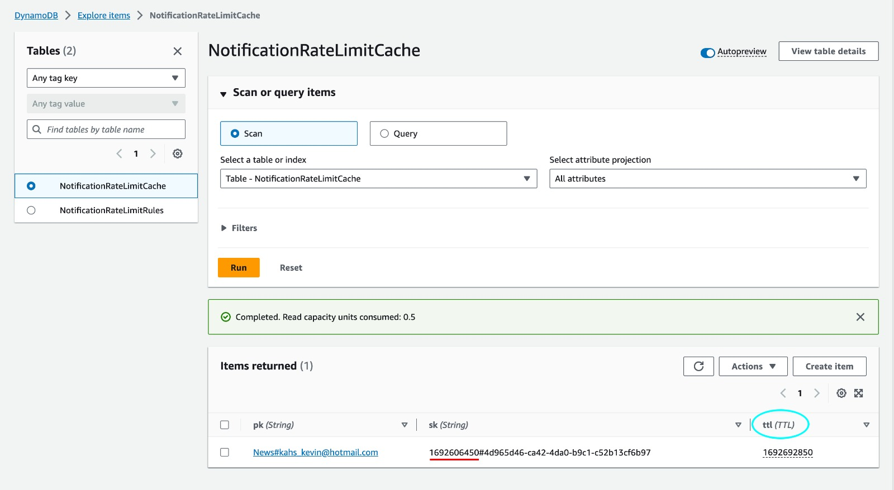
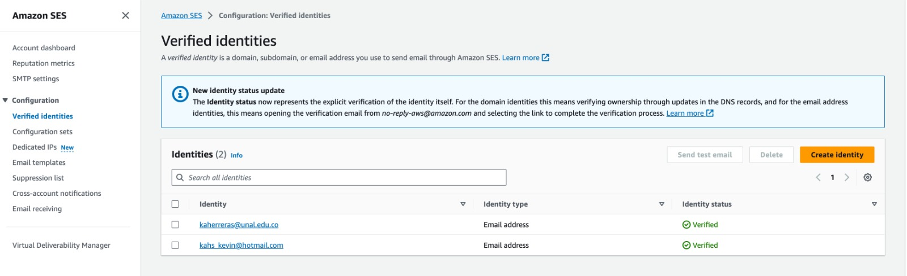
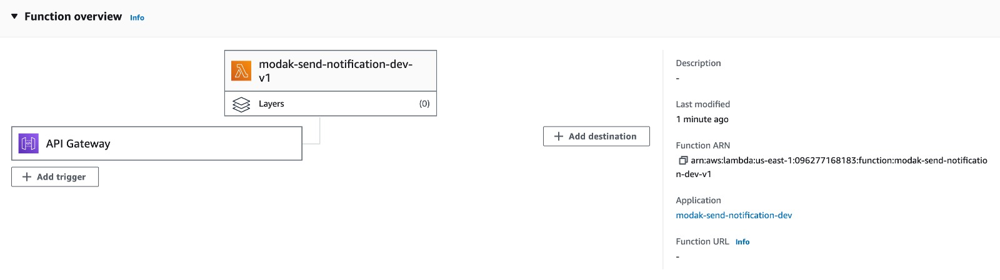
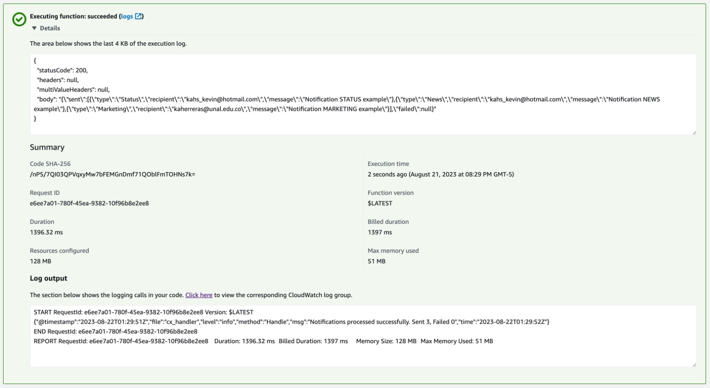
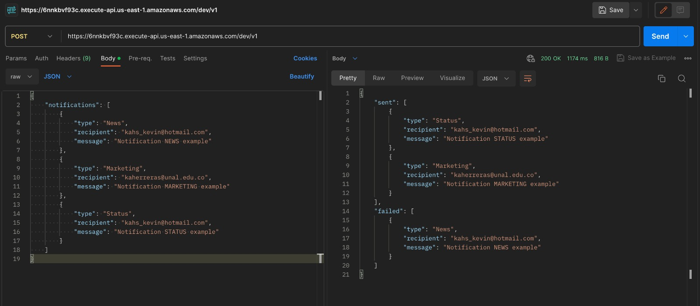
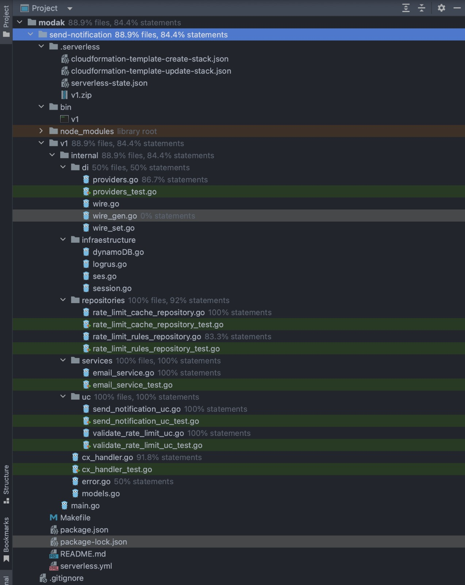
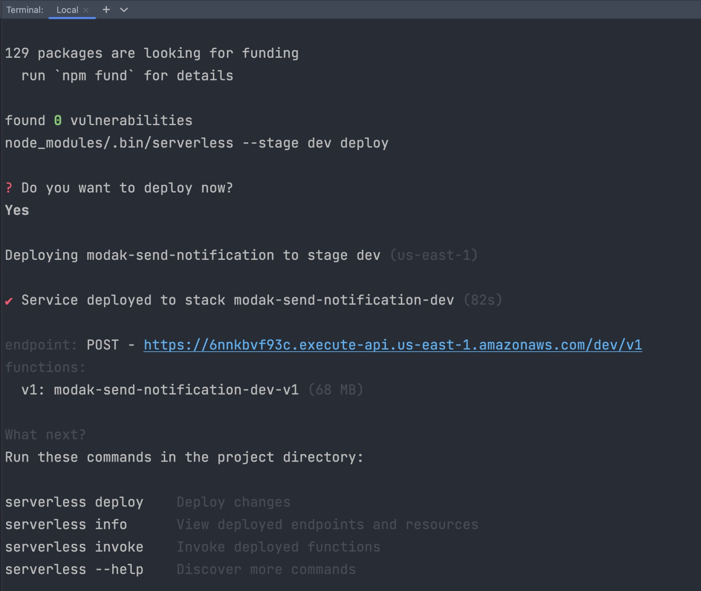
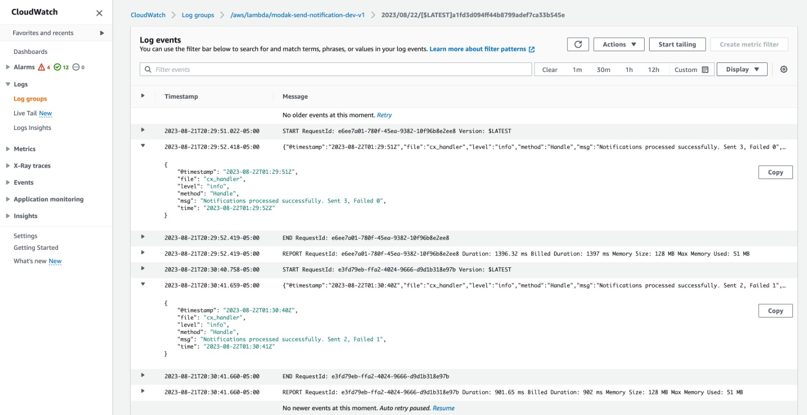

# Rate limit notification service

We have a Notification system that sends out email notifications of various types (update, daily news, project invitations, etc). We need to protect recipients from getting too many emails, either due to system errors or due to abuse, so let's limit the number of emails sent to them by implementing a rate-limited version of NotificationService.
The system must reject requests that are over the limit.

Some sample notification types and rate limit rules, e.g.:
-   Status: not more than 2 per minute for each recipient
-   News: not more than 1 per day for each recipient
-   Marketing: not more than 3 per hour for each recipient
-   Etc. these are just samples, the system might have several rate limit rules!

NOTES:
-   Your solution will be evaluated on code quality, clarity and development best practices.
-   Feel free to use the programming language, frameworks, technologies, etc that you feel more comfortable with.
-   Below you'll find a code snippet that can serve as a guidance of one of the implementation alternatives in Java. Feel free to use it if you find it useful or ignore it otherwise; it is not required to use it at all nor translate this code to your programming language.

# Introduction

I have developed a web service designed to manage and send notifications in an efficient and controlled way. The main goal is to ensure that recipients do not receive an excess of emails, either due to system errors or excessive use.
The service accepts requests through a POST method, where the input is a JSON object containing the notifications that you want to send. The structure of the object is simple: it consists of an array of notifications that, once received, are processed by the system. During this process, the system checks each notification against the established rate limit rules. Notifications that comply with these rules are sent via email, while those that do not comply are rejected.

## Infrastructure Amazon Web Services

To make the most of my cloud services skills, I have structured the solution using AWS. The centerpiece is a Lambda function written in Golang, which is triggered by an API Gateway. The creation and configuration of this role, along with its permissions and dependencies, has been automated using the Serverless framework. To deploy the service to your AWS account, simply run the `make dev` command in your terminal.

In order to offer a comprehensive solution and demonstrate my knowledge of cloud services, I have incorporated DynamoDB database tables to manage the data. Also, for sending emails, I have opted for the Amazon SES service, thus guaranteeing efficient and reliable delivery of notifications.

## Architecture used

I have chosen to implement the Clean Architecture style, a widely recognized software architecture in the world of microservices. This structure promotes the separation of logic into different layers, thus guaranteeing independence between classes and ensuring that each one has a unique responsibility. In addition to these benefits, the Clean Architecture makes it easier to organize code and simplifies unit and integration testing.

# My Solution


My goal with this solution was to maintain an elegant simplicity, thus allowing me to demonstrate, albeit superficially, my skills and knowledge in creating microservices, integrating with cloud services, and applying best practices in software development.

I opted for Golang version 1.21 as the programming language. It is a robust, fast and practical language with which I am not only comfortable, but also an expert. Its simplified nature for building microservices, coupled with its efficient concurrency handling, gives me the confidence that I can tackle and solve this test, thus reflecting my capabilities as a Senior Backend Developer.

As I mentioned earlier, my solution is centered around a simple RESTful service. Through it, the user or system can send a request to the endpoint and activate the functionality of the Lambda function. I considered several alternative triggers, such as SNS, SQS, and Event Bridge, among others. However, I chose API Gateway to make it easier for the reader of this document to test using a client like Postman. This choice also provided me with an excellent opportunity to demonstrate my experience working with cloud services. Given the simplicity of the service, I decided not to use the JSON API Spec to avoid introducing unnecessarily complex structures that would add no value to this functionality.


In pondering the best approach to the problem, I identified that rate limiter rules share a common behavior: a maximum number of notifications in a specified time range. These ranges can vary: minutes, hours, days, etc. My main challenge was selecting a unit of measure for time. I chose minutes as it seemed the most logical choice and in line with the examples provided. Furthermore, it is not common to find systems that establish rate limit rules based on requests per second. Therefore, minutes became my standard unit of measurement, allowing me to represent any higher range and offering an intuitive understanding, unlike seconds.

Additionally, I reflected on the core of the problem: the rules that determine the behavior of the rate limiter in our software. These rules could be defined by the behavior of different classes in the software, based on the type of notification. However, this structure would complicate long-term scalability, making the process of adding new rule types tedious. This same complication would arise when trying to define a map class or constant in code, resulting in unmaintainable source code and inefficient when introducing new rules. For these reasons, I chose to use a table in DynamoDB, a non-relational database that facilitates fast and efficient queries. In this table, it is possible to add or modify the rules that the rate limiter will apply to system notifications.

As development progressed, I identified the need to maintain a cache log to keep track of notifications sent, segmented by type and user. My first consideration was to use the Elasticache service, which offers a Redis cluster, an ideal key-value database for cache management. However, based on the design I had in mind, where I planned to use a composite key of type NotificationType#UserEmail and a timestamp value to record the last email sent, I hit a snag. The problem statement indicates that certain types of notifications can be sent more than once in a specific period. Because of this, I opted for an additional table in DynamoDB. Despite the trend towards single table design, I decided to keep two separate tables to clearly delineate the purpose of each, since they are not intrinsically related beyond the domain itself. After reflecting on the queries I would perform against this table, I concluded that it would be efficient. However, over time, the table could grow considerably. To address this challenge, I implemented a TTL based on the notification type and its respective time range in minutes, thus avoiding unnecessary data accumulation in the database.


The choice of the unix timestamp standard was essential for the development of this test. Its numerical representation of the date, accurate to the second, makes it easy to use. However, during the implementation of the cache system, I identified a possible limitation that could lead to a bug or future complication. If we consider a small number of notifications sent to different users, there would be no cause for concern. But, what would happen if the same user received two or more notifications of the same type in the same second? Due to the nature of DynamoDB, if a record with the same primary and ordering keys is inserted, the original record is overwritten, which could lead to undesirable behavior.
One solution might have been to use a more granular timestamp, based on milliseconds or microseconds. However, I wanted to maintain consistency across all software with the unix timestamp standard. Therefore, I designed a composite key for the sorting key (SK) that would guarantee its uniqueness, thus avoiding collisions. This key combines the timestamp with a UUID, taking the form Timestamp#UUID. This solution not only prevents collisions at the level of seconds or milliseconds, but also avoids any type of collision, guaranteeing the integrity of the data.

Although it wasn't the main focus of the test, I thought it would be valuable to implement the notification system as well. To do this, I turned to Amazon SES, an AWS service specialized in sending emails. Although the service currently operates in "sandbox" mode and only allows emails to be sent to previously validated addresses, it is perfectly adequate for the purposes of this test.

With these considerations, I moved forward in the development of my solution. It has a controller called `cx_handler`, which invokes two different use cases: one to validate the rate limiter rules and another to send emails. Next, I will detail the operation of these use cases.

**ValidateRateLimitUC:** This use case has the responsibility of determining if a notification can be sent, taking into account its nature and the rules established by the rate limiter. To do this, it interacts with two repositories:

1. The first gets the specific rules that apply to the notification in question.
2. The second queries the cache table to check which notifications have been sent previously.

With this information, the system determines if it can proceed with sending the notification. If the answer is yes, it updates the cache to record that that user has been notified.

**SendNotificationUC:** This use case deals specifically with sending notifications. Since the notification has been previously validated and its invocation is guaranteed only when the established rules are met, it proceeds directly to sending it. To do this, I use a service that integrates with Amazon SES and manages the sending of the email. It is important to note that, although in this instance an email was chosen, the system could be adapted to send text messages or any other type of notification.

It is essential to highlight that our system is designed to manage the sending of multiple notifications simultaneously. Given this need, I saw an opportunity to take advantage of the concurrency that Golang offers, allowing each notification to be evaluated independently in separate threads. This decision also gives me the opportunity to demonstrate my ability to manage concurrency with this programming language. Although I had the option of using waitgroups or channels, I went with channels. This choice was made because he wanted to provide a response to the end user through the endpoint, reporting which notifications were sent successfully and which were not.

Finally, but just as important, I decided to incorporate a logging system inside the lambda function. As an engineer, I am fully aware of the importance of monitoring and observability, especially after the delivery of a module or subsystem. For this, I opted for the Logrus library, which makes it easy to store logs in CloudWatch with different log levels. In this exercise, I mainly used two levels: info and error. A valuable piece of data that I decided to record is the number of emails sent in each execution, the notifications that failed, and any errors that may arise in the system. Although I am familiar with the Elastic Common Schema, for this exercise I adopted a simplified version, always keeping its structure in mind. It is true that a monitoring plan requires a detailed context adapted to the specific needs, but I consider that these bases are essential to guarantee optimal visibility of our system, both in successful situations and in failures.

## Unit tests

I carried out the respective unit tests for all the files of my code, achieving a hight coverage testing all the flows that had to do with the logic of my application following good practices.

## Functional tests

I carried out the respective functional tests using the Postman desktop program that facilitates this process for web services, within the code there is the respective collection to be able to be imported into the program.

# Sequence Diagram



# Contracts

## Request

POST request to: https://6nnkbvf93c.execute-api.us-east-1.amazonaws.com/dev/v1
```json  
{
	"notifications":  [
		{
			"type":  "News",
			"recipient":  "kahs_kevin@hotmail.com",
			"message":  "Notification NEWS example"
		},
		{
			"type":  "Marketing",
			"recipient":  "kaherreras@unal.edu.co",
			"message":  "Notification MARKETING example"
		},
		{
			"type":  "Status",
			"recipient":  "kahs_kevin@hotmail.com",
			"message":  "Notification STATUS example"
		}
	]
}
```
## Responses
### 200 HTTP OK
```json  
{
	"sent":  [
		{
			"type":  "Marketing",
			"recipient":  "kaherreras@unal.edu.co",
			"message":  "Notification MARKETING example"
		},
		{
			"type":  "Status",
			"recipient":  "kahs_kevin@hotmail.com",
			"message":  "Notification STATUS example"
		}
		],
		"failed":  [
		{
			"type":  "News",
			"recipient":  "kahs_kevin@hotmail.com",
			"message":  "Notification NEWS example"
		}
	]
}
```
### 500 Internal Server Error (Unexpected errors)
```json  
{  
    "errors": [  
        {  
            "id": "ID_GENERAL_ERROR",  
            "status": "500",  
            "code": "CODE_GENERAL_ERROR",  
            "title": "Error",  
            "detail": "Unexpected error"
        }  
    ]  
}
```
## How to deploy

To deploy the application it is necessary to have AWS CLI installed and configured on your computer along with node JS to run the latest version of the serverless framework. Once this is done please clone the repository on your computer and in a terminal located at the root of the project please run the command:

***make dev***

this will perform the deployment automatically and expose a valid endpoint to be able to interact with the API without any issue.

#### [Github Repository Link](https://github.com/KevinAndrey96/notifications-rate-limiter)

## Execution evidences
### DynamoDB rate limit rules table


### DynamoDB rate limit cache table


### Amazon SES verified identities


### Lambda function diagram


### Executing lambda function in AWS console


### Consuming the service using Postman


### Project structure


### Project deploy


### Cloudwatch logs


## Author

Kevin Andrey Herrera Silva ✌🏻
